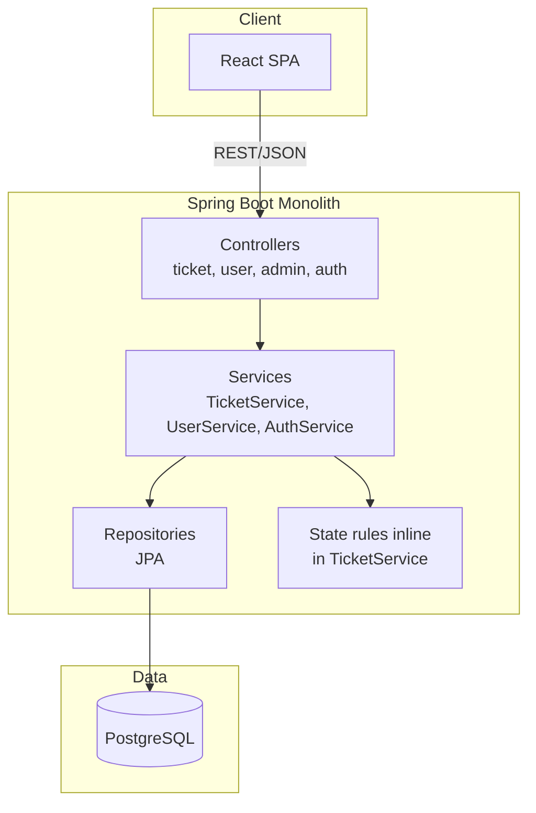
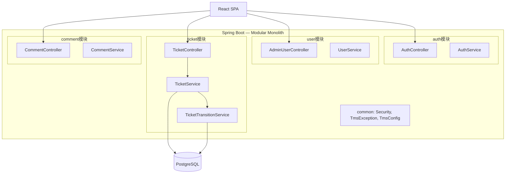
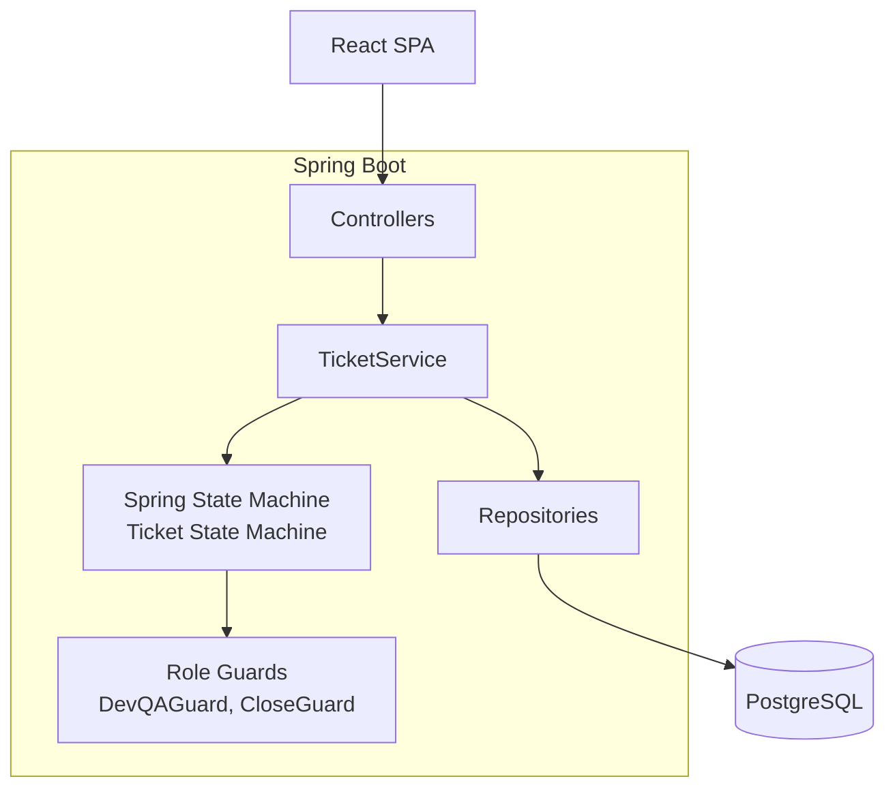
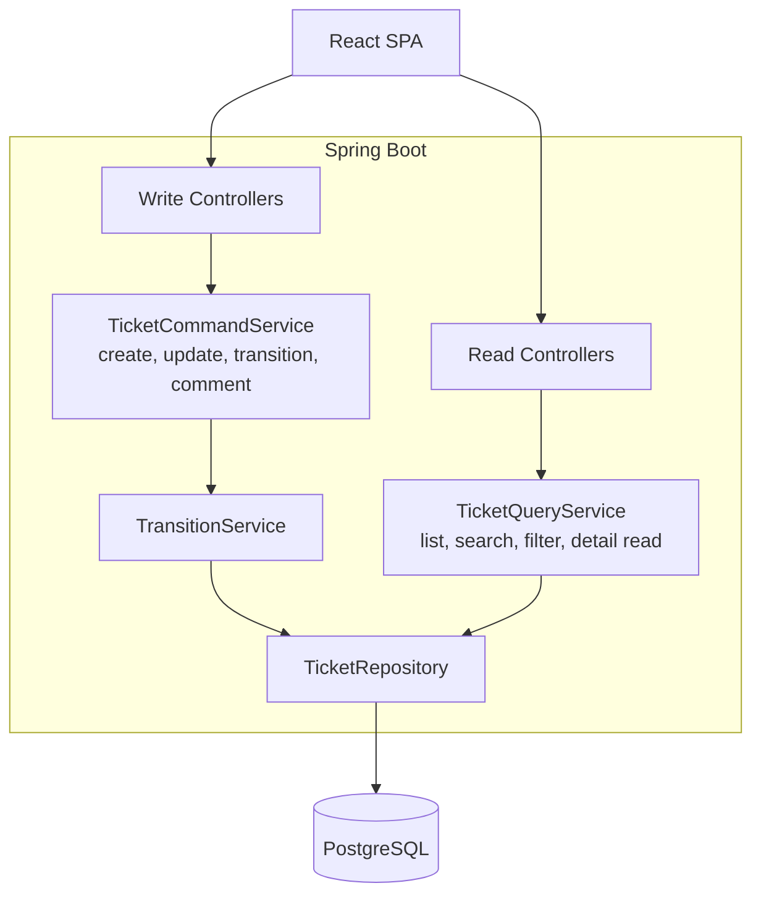
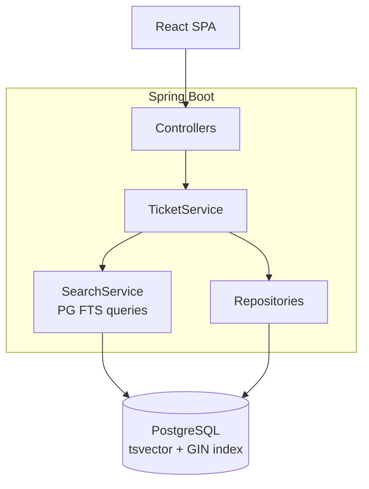

# Architecture Analysis: Support Ticket Management System

**Feature**: `001-support-tickets`  
**Source of truth**: [`spec.md`](./spec.md)  
**Project governance**: [`.specify/memory/constitution.md`](../../.specify/memory/constitution.md)  
**Date**: 2026-09-13  
**Status**: Architecture analysis (input for `plan.md` — not an implementation plan)

> **Note on technology stack**: `spec.md` is intentionally technology-agnostic for
> requirements. Persistence to a database, server-side validation, REST-style API
> behavior, and a web UI are explicit in the spec. The mandated implementation
> stack for this repository is defined in the project constitution: **Java 21,
> Spring Boot 3.x, Gradle, PostgreSQL (prod) / H2 (local/test), Spring Data JPA,
> Flyway/Liquibase, REST/JSON, Spring Security, Springdoc OpenAPI, React SPA,
> SLF4J/Logback, Spring Boot Actuator**. All five solutions below use this stack;
> no alternative technologies are introduced.

---

## Step 1 — Requirements Analysis (from spec.md)

### Explicit Requirements

#### Functional

| Area | Requirements |
|------|-------------|
| **Auth** | FR-001–004: Admin creds encoded in application properties; admin user-management page (register, reset password, assign roles); roles Admin/Developer/QA/User; auth required for all operations |
| **Tickets** | FR-005–009: Create (default OPEN), view details, update title/description/priority, any user may change assignee, priorities LOW/MEDIUM/HIGH/CRITICAL |
| **Comments** | FR-010: Authenticated users add comments with author + timestamp |
| **Search/Filter** | FR-011–017: Keyword search title+description only; filter by status and assignee; default = my assignments; ALL option; 30/page; grouped by status sections |
| **State machine** | FR-018–022: Enforced server-side transitions; role-gated (Dev/QA); CLOSED = creator or QA only |
| **Persistence** | FR-023–027: DB persistence survives restart; server validation; structured errors; no plaintext secrets (except encoded admin in properties) |

#### Non-Functional (from Success Criteria)

| ID | Requirement |
|----|-------------|
| SC-001 | Create ticket + see in list within 30 seconds |
| SC-002 | 100% valid transitions succeed; 100% invalid/unauthorized rejected |
| SC-003 | Search returns within 2 seconds for up to **1,000 tickets** |
| SC-004 | Zero data loss on normal restart |
| SC-005 | 100% validation/auth failures show human-readable UI errors |
| SC-006 | All FR-018 transitions auto-verified before release |
| SC-007 | Max 30 tickets/page with status-section grouping |

#### Business Rules

- State machine: `OPEN → IN_PROGRESS → RESOLVED → CLOSED`; `OPEN|IN_PROGRESS → CANCELLED`; terminal states immutable
- Role matrix per spec (Admin manages users; Dev/QA transition; creator/QA close)
- Default list = assignee = current user; unassigned tickets only in ALL/broader filter
- Concurrent updates: **last write wins** (explicit edge case)
- No audit trail of field changes in v1

#### Data Requirements

- **Entities**: User, Ticket, Comment (attributes per spec Key Entities section)
- **Relationships**: Ticket → creator (User), assignee (User optional), comments (1:N)
- **Volume assumption**: Search target ≤ 1,000 tickets (SC-003)

#### State-Management Requirements

- Server-enforced finite state machine with role-based transition guards
- Invalid transitions and unauthorized actors rejected with explicit errors
- No client-side-only enforcement

#### API Requirements (behavioral, from spec)

- REST JSON API (constitution + spec server validation/structured errors)
- Operations: auth, user admin, ticket CRUD, assignee update, comment create, status transition, search/filter/list with pagination
- OpenAPI documentation (constitution)

#### Security Requirements

- Spring Security (constitution); BCrypt-style encoding for passwords
- Admin bootstrap via encoded application properties
- Role-based authorization on admin page and status transitions
- No committed plaintext secrets (FR-027)

#### Scalability / Performance (explicit)

- 1,000 tickets search ceiling (SC-003)
- 30 tickets per page (FR-016, SC-007)
- No multi-tenant, no HA/uptime SLA stated

#### Technology Constraints (constitution — governing this feature)

- Monolithic Spring Boot acceptable; microservices not mandated
- PostgreSQL + JPA; layered architecture (controller → service → repository)
- React frontend; optional Redis/Kafka **not required** by spec

#### Explicit Assumptions (from spec)

- Single role per user; admin assigns roles
- Five status section headers always visible
- Comment search out of scope
- Responsive web only; no notifications/attachments/audit log

### Architectural Assumptions (required for design decisions)

| # | Assumption | Rationale |
|---|------------|-----------|
| A1 | Single organization, single deployment | No multi-tenant requirement in spec |
| A2 | Concurrent users in tens, not thousands | SC-003 caps at 1,000 tickets total |
| A3 | Read-heavy list/search, moderate writes | Ticket system typical pattern; not stated but reasonable for sizing |
| A4 | Single PostgreSQL instance sufficient for v1 | Matches scale; no sharding requirement |
| A5 | Team size small (1–5 developers) | Learning project context; favors simplicity |

### Unknowns (could materially affect architecture)

| # | Unknown | Impact if wrong |
|---|---------|-----------------|
| U1 | Peak concurrent users | Affects connection pool / instance count |
| U2 | Expected ticket growth beyond 1,000 | May require FTS, pagination strategy change, or caching |
| U3 | Whether admin holds Developer/QA role simultaneously | Affects auth test matrix (spec footnote suggests optional) |
| U4 | Deployment target (local only vs cloud) | Affects HA, backup, observability investment |
| U5 | Whether status-grouped view means 5 parallel paginated lists or one combined page | Affects API design for list endpoint |

---

## Step 2 — Architectural Drivers (ranked)

| Rank | Driver | Why it matters |
|------|--------|----------------|
| 1 | **State machine correctness + role guards** | Core business rule; must be server-enforced, testable (SC-002, SC-006); wrong design = data corruption |
| 2 | **Security model (admin props + DB users + 4 roles)** | Dual auth source (properties admin vs DB users); complex authorization matrix |
| 3 | **Simplicity / delivery speed** | No scale/HA requirements; over-engineering wastes effort |
| 4 | **Data consistency on transitions** | Transitions must be atomic; concurrent last-write-wins acceptable per spec |
| 5 | **Search/filter UX (status sections + assignee + keyword)** | Drives query design; 1,000-ticket ceiling keeps SQL viable |
| 6 | **Testability of state machine** | Integration tests mandated; isolation of transition logic reduces risk |
| 7 | **Persistence durability** | Standard RDBMS ACID; straightforward with PostgreSQL |
| 8 | **Observability** | Actuator/logging required by constitution; no custom metrics in spec |
| 9 | **Future extensibility** | Audit trail, notifications out of scope but may return |
| 10 | **Horizontal scalability** | **Not a driver** — no requirement |

---

## Step 3 — Five Architectural Solutions

All solutions share: React SPA → Spring Boot REST API → PostgreSQL (H2 for tests), Spring Security, JPA, Flyway migrations, global `@ControllerAdvice` error handling.

---

### Solution 1: Classic Layered Monolith

#### Architecture

Single Spring Boot application with horizontal layers. React SPA calls REST controllers. All business logic in service classes; JPA repositories for persistence.



| Component | Responsibility |
|-----------|----------------|
| React SPA | UI, forms, error display, status sections, filters |
| Controllers | HTTP mapping, `@Valid` DTO validation, auth annotations |
| Services | All business logic including state transitions inline |
| Repositories | CRUD + query methods |
| PostgreSQL | Single source of truth |

**Deployment**: One JVM process + one DB. Frontend static assets served by Spring or separate dev server.

#### Data Flows

| Use Case | Flow |
|----------|------|
| Create ticket | UI → `POST /tickets` → Controller validates → TicketService sets OPEN → save → 201 |
| List/search | UI → `GET /tickets?assignee=me&status=...&q=...&page=` → Service builds JPA query → paginated DTO |
| View detail | `GET /tickets/{id}` → load ticket + comments |
| Update fields | `PATCH /tickets/{id}` → validate → save (no status change here) |
| Add comment | `POST /tickets/{id}/comments` → validate → save |
| Status change | `POST /tickets/{id}/transitions` → TicketService checks role + valid transition → update status |

#### State Machine Enforcement

Transition logic lives **inside `TicketService.transitionStatus()`**: switch on current status, check target, verify caller role (Dev/QA, creator/QA for CLOSE). Single `@Transactional` method updates ticket row.

- **Concurrency**: Last-write-wins; no versioning
- **Audit**: Only current status stored (per spec)
- **Invalid transition**: Throw `TmsException(INVALID_TRANSITION)` before DB write

#### API / Domain Boundaries

- Controllers: HTTP only
- Services: business rules + validation
- Repositories: persistence
- Errors: `TmsException` → `ErrorCode` → JSON error body → UI message

#### Persistence

```text
users (id, username, password_hash, display_name, email, role)
tickets (id, title, description, status, priority, assignee_id, created_by_id, created_at, updated_at)
comments (id, ticket_id, author_id, body, created_at)
```

**Indexes**: `tickets(status)`, `tickets(assignee_id)`, `tickets(created_by_id)`, `tickets(title)` + `GIN/ILIKE` on description optional  
**Search**: `WHERE (LOWER(title) LIKE %q% OR LOWER(description) LIKE %q%)`  
**Transactions**: `@Transactional` on service methods

#### Failure Handling

| Failure | Response |
|---------|----------|
| DB down | 503 via Spring error handling; connection pool exhaustion logged |
| Invalid transition | 400/403 with structured error |
| Concurrent update | Last write wins; no conflict detection |
| Duplicate POST | May create duplicate tickets (no idempotency key in spec) |

---

### Solution 2: Modular Monolith (Package-by-Domain)

#### Architecture

Single deployable, but **bounded modules** by domain: `auth`, `user`, `ticket`, `comment`. Each module owns controller, service, repository, DTOs. Shared `common` for security, exceptions, config.



**Key difference from S1**: Dedicated `TicketTransitionService` isolates state machine; modules communicate only via service interfaces (no cross-module repository access).

#### State Machine Enforcement

`TicketTransitionService` is the **single entry point** for status changes:
1. Load ticket
2. `TransitionPolicy.canTransition(current, target, actor, ticket)`
3. If allowed → update; else throw

Enables focused unit tests on policy class without mocking entire TicketService.

#### Persistence / Search

Same schema as S1. `TicketQueryService` (optional split) handles list/search queries within ticket module.

#### Failure Handling

Same as S1; module boundaries add compile-time isolation but same runtime failure modes.

---

### Solution 3: Layered Monolith + Spring State Machine

#### Architecture

Uses **Spring State Machine** library for ticket lifecycle. Transition definitions in configuration; guards for roles wired as SpEL or custom Guard implementations.



#### State Machine Enforcement

States and events configured declaratively:
- Events: `START_PROGRESS`, `RESOLVE`, `CLOSE`, `CANCEL`
- Guards: `@Autowired` role check beans
- Persistence: State machine persisted via ticket `status` column (machine reset from DB on load)

**Risk**: Spring State Machine adds framework complexity for a 5-state FSM.

#### When it shines

If workflow grows (many states, parallel regions). **Overkill for current spec.**

---

### Solution 4: CQRS-Lite Monolith (Command / Query Split)

#### Architecture

Single app, but **separate services** for writes (commands) vs reads (queries). Write path enforces invariants; read path optimized for list/search/status grouping.



#### Data Flow — List/Search

`TicketQueryService` builds dynamic JPA/Criteria queries combining assignee filter, status sections, keyword, pagination (30/page). Potentially separate read-optimized DTO projections.

#### State Machine

Commands only mutate via `TicketCommandService.transition()` → `TransitionService`. Queries never write.

#### Trade-off

More classes than S1/S2; justified if read paths become complex. For 1,000 tickets, benefit is **marginal**.

---

### Solution 5: Layered Monolith + PostgreSQL Full-Text Search

#### Architecture

Same layered structure as S1, but keyword search uses **PostgreSQL `tsvector` + GIN index** instead of `ILIKE`. Optional materialized view for status-grouped counts.



#### Search Strategy

- On ticket save: update `search_vector = to_tsvector(title || description)`
- Query: `search_vector @@ plainto_tsquery(:q)`
- Filters: standard SQL on status, assignee_id

#### State Machine

Same as S1 (inline or extracted service).

#### When justified

>10k tickets or sub-second search on large text. At **1,000 tickets**, ILIKE is sufficient — this solution optimizes prematurely unless growth is expected (Unknown U2).

---

## Step 4 — Per-Architecture Analysis

### A. SWOT Summary

| Solution | Strengths | Weaknesses | Opportunities | Threats |
|----------|-----------|------------|---------------|---------|
| **S1 Classic Layered** | Simplest; matches constitution; fast to build | State logic may sprawl in TicketService | Easy onboarding | God-service if not disciplined |
| **S2 Modular Monolith** | Clear boundaries; testable transition service; matches `com.tms.<domain>` | Slightly more structure upfront | Add modules (notifications) later | Over-modularization for tiny team |
| **S3 Spring State Machine** | Declarative FSM; framework guard support | Heavy; learning curve; 5-state FSM overkill | Complex workflows later | Framework lock-in; harder debugging |
| **S4 CQRS-Lite** | Read/write optimization paths | 2× service surface; more boilerplate | Scale reads independently later | YAGNI violation at current scale |
| **S5 PG FTS** | Fast search at scale | Migration complexity; PG-specific | Growth without rearchitecture | Unnecessary ops for 1,000 tickets |

### B. Trade-off Scores (1–5)

| Criterion | S1 | S2 | S3 | S4 | S5 |
|-----------|----|----|----|----|-----|
| Simplicity | 5 | 4 | 2 | 3 | 3 |
| Development effort | 5 | 4 | 2 | 3 | 3 |
| Maintainability | 3 | 5 | 3 | 4 | 4 |
| Scalability | 3 | 4 | 3 | 4 | 5 |
| Performance | 4 | 4 | 4 | 4 | 5 |
| Reliability | 4 | 4 | 3 | 4 | 4 |
| Data consistency | 4 | 5 | 4 | 5 | 4 |
| Concurrency handling | 3 | 3 | 3 | 3 | 3 |
| Testability | 3 | 5 | 4 | 4 | 4 |
| Observability | 4 | 4 | 3 | 4 | 4 |
| Operational complexity | 5 | 5 | 3 | 4 | 4 |
| Cost | 5 | 5 | 4 | 5 | 5 |
| Security complexity | 4 | 4 | 4 | 4 | 4 |
| Future extensibility | 3 | 5 | 4 | 4 | 4 |
| Migration flexibility | 4 | 5 | 2 | 3 | 3 |
| **Overall fit** | **4** | **5** | **2** | **3** | **3** |

### C. Risk Analysis (selected)

| Risk | S1 | S2 | S3 | Level | Mitigation |
|------|----|----|-----|-------|------------|
| State machine bugs | Med | Low | Med | High | Dedicated transition service + integration tests (SC-006) |
| TicketService becomes god-class | High | Low | Med | Med | Extract transition + query helpers |
| Spring State Machine complexity | — | — | High | Med | Avoid unless workflow grows |
| Search perf at scale | Low | Low | Low | Med (future) | ILIKE now; add FTS when >5k tickets |
| Dual admin auth (props vs DB) | Med | Med | Med | Med | Separate `AdminAuthenticationProvider` |
| Last-write-wins data loss | Med | Med | Med | Low | Accepted per spec; document behavior |

### D. Failure-Mode Analysis

| Failure | S1/S2/S4/S5 | S3 |
|---------|-------------|-----|
| DB unavailable | API 503; UI error message | Same |
| App instance down | Full outage (single instance) | Same |
| Search slow | Timeouts at 2s (SC-003); log slow queries | FTS reduces risk at scale |
| Invalid transition | 400/403; no DB change | Guard blocks; ensure DB sync |
| Concurrent updates | Last write wins | Same |
| Duplicate create POST | Duplicate tickets | Idempotency not in spec — accept or add later |

### E. Evolution Analysis

| Scale | S1 Classic | S2 Modular | S3 SSM | S4 CQRS | S5 FTS |
|-------|-----------|------------|--------|---------|--------|
| **Small** (≤1k tickets) | ✅ Ideal | ✅ Ideal | ⚠️ Over-engineered | ⚠️ Over-engineered | ⚠️ Premature |
| **Medium** (1k–10k) | ✅ OK with indexes | ✅ Good | ✅ If workflow grows | ✅ Read tuning | ✅ Search shines |
| **Large** (10k+) | ⚠️ Search bottleneck | ✅ Extract modules | ✅ | ✅ Cache reads | ✅ |
| **Very Large** | ❌ Redesign | ⚠️ → services | ⚠️ | ✅ → full CQRS | ✅ |

**Migration trigger**: SC-003 search SLA breach or ticket count >5,000 → consider FTS (S5) or read replica.

---

## Step 5 — Consolidated Comparison

See trade-off table above. **Key differences**:

1. **S1 vs S2**: Same deployable; S2 adds module boundaries and extracted transition service — better testability, marginally more files.
2. **S3**: Framework-driven FSM — powerful but disproportionate to 5 states and 4 roles.
3. **S4**: Separates reads/writes — useful at higher scale, not needed for v1 acceptance criteria.
4. **S5**: Search optimization — spec caps at 1,000 tickets where ILIKE + indexes suffice.

---

## Step 6 — Second-Pass Re-evaluation

| Question | Answer |
|----------|--------|
| Over-engineering? | **S3, S4, S5** yes for v1; **S1/S2** appropriate |
| Unnecessary components? | Spring State Machine, separate read DB, FTS, Kafka, Redis — all unnecessary now |
| Optimizing for hypothetical scale? | S4/S5 optimize beyond SC-003 (1,000 tickets) |
| Hidden SPOFs? | Single DB and single app instance — acceptable; no HA requirement |
| Distributed concerns needed? | No — spec + scale do not justify |
| State machine harder? | S3 adds indirection; S1 risks scattered `if` chains |
| Transaction/consistency harder? | CQRS (S4) adds eventual-consistency risk if misused — avoid |
| Operational complexity without benefit? | S3, S5 add ops burden |
| Incremental evolution? | **S2** modular monolith evolves best: extract transition tests now, add FTS or CQRS later as modules |

**Conclusion**: Select **Solution 2 — Modular Monolith** with pragmatic simplifications (no CQRS, ILIKE search, no Spring State Machine).

---

## Step 7 — Final Architecture Recommendation

### Decision: Modular Layered Monolith (Solution 2, simplified)

Single Spring Boot deployable + React SPA + PostgreSQL. Domain packages: `auth`, `user`, `ticket`, `comment`, `common`. Dedicated **`TicketTransitionPolicy`** (pure Java) + **`TicketTransitionService`** for all status changes.

```mermaid
flowchart TB
    subgraph "React SPA"
        Pages[Login | Admin Users | Ticket List | Ticket Detail]
    end
    subgraph "Spring Boot API"
        direction TB
        SEC[Spring Security<br/>AdminAuthProvider + UserAuth]
        subgraph ticket domain
            TC[TicketController]
            TQS[TicketQueryService]
            TCS[TicketCommandService]
            TTP[TicketTransitionPolicy]
            TTS[TicketTransitionService]
        end
        subgraph user domain
            UC[AdminUserController]
            US[UserService]
        end
        subgraph comment domain
            CC[CommentController]
            CS[CommentService]
        end
        EX[@ControllerAdvice<br/>TmsException → ErrorResponse]
    end
    DB[(PostgreSQL / H2)]
    Pages -->|REST JSON| SEC
    SEC --> TC & UC & CC
    TC --> TQS & TCS & TTS
    TCS --> TTS
    TTS --> TTP
    TQS & TCS & TTS & US & CS --> DB
    EX -.-> Pages
```

### Why this fits spec.md

| Requirement | How architecture addresses it |
|-------------|-------------------------------|
| FR-018–022 State machine | `TicketTransitionPolicy` encodes transitions + role rules; single transactional service |
| FR-001 Admin in properties | `AdminAuthenticationProvider` reads encoded creds from `TmsConfig` |
| FR-002 User admin page | `user` module `AdminUserController` |
| FR-011–017 Search/filter | `TicketQueryService` with dynamic criteria; 30/page; status grouping in API response shape |
| SC-006 Integration tests | `TicketTransitionPolicyTest` (unit) + `@SpringBootTest` transition tests |
| Constitution layered arch | Controllers → Services → Repositories preserved per module |
| YAGNI | No microservices, CQRS, FTS, or message queues |

### Why not the others

| Rejected | Reason |
|----------|--------|
| S1 Classic | Viable fallback, but transition logic risks coupling; S2 adds minimal cost for better SC-006 compliance |
| S3 Spring State Machine | Disproportionate complexity for 5-state FSM |
| S4 CQRS-Lite | No read/write scale divergence in spec |
| S5 PG FTS | SC-003 ceiling is 1,000 tickets; ILIKE + B-tree indexes sufficient |

### Conscious trade-offs

- **Accept**: Single instance SPOF; last-write-wins concurrency; no idempotency keys; no audit history
- **Defer**: FTS, caching, read replicas, notifications, audit log
- **Depend on**: A1–A5 assumptions; ticket volume ≤1,000 for v1

### Remaining risks

| Risk | Severity | Mitigation |
|------|----------|------------|
| Dual auth paths (admin props vs DB users) | Medium | Separate security config; integration tests for both |
| Status-grouped pagination ambiguity (U5) | Medium | Clarify in plan: one API returns grouped sections with per-section pagination |
| TicketService scope creep | Medium | Enforce module boundaries in code review |

### Component Responsibilities

| Component | Owns |
|-----------|------|
| `TicketController` | HTTP mapping, DTO validation |
| `TicketCommandService` | Create, update fields, assignee change |
| `TicketQueryService` | List, search, filter, detail read, pagination |
| `TicketTransitionService` | Status changes only; `@Transactional` |
| `TicketTransitionPolicy` | Pure transition + authorization rules (no DB) |
| `CommentService` | Add/list comments |
| `UserService` | CRUD users, password reset, role assignment |
| `AdminAuthenticationProvider` | Admin login from properties |
| `DaoAuthenticationProvider` | DB user login |

### Request / Data Flow — Status Transition

```text
POST /api/tickets/{id}/transitions  { "targetStatus": "IN_PROGRESS" }
  → TicketController (@PreAuthorize Dev or QA)
  → TicketTransitionService.transition(id, target, principal)
      → load ticket (SELECT ... FOR UPDATE optional; last-write-wins OK)
      → TicketTransitionPolicy.evaluate(ticket, target, actor)
      → if invalid: throw TmsException(INVALID_TRANSITION | FORBIDDEN)
      → ticket.setStatus(target); save
  → 200 + TicketDto
```

### Transaction Boundaries

- One transaction per command (create, update, transition, comment)
- Transition: load + validate + save in single `@Transactional`
- Query methods: `@Transactional(readOnly = true)`

### Error Handling

- Domain: `TmsException(ErrorCode.*)`
- API: `@ControllerAdvice` → `{ code, message, fieldErrors? }`
- UI: map `code` to user-friendly strings; never show stack traces (SC-005)

### Scaling Strategy (v1)

- Vertical scaling (more JVM heap) if needed
- DB indexes on `status`, `assignee_id`, `created_by_id`
- Add connection pool tuning before second instance
- Second instance + load balancer only when U1 (concurrent users) demands it

### Observability

- Spring Boot Actuator: health, metrics
- SLF4J structured logs on transitions (ticket id, from, to, actor)
- No distributed tracing required for v1

---

## Step 8 — Architecture Decision Record

```text
Decision:
  Modular Layered Monolith — single Spring Boot 3.x application (Java 21)
  with domain packages (auth, user, ticket, comment), React SPA frontend,
  PostgreSQL persistence, and a dedicated TicketTransitionPolicy +
  TicketTransitionService for state machine enforcement.

Context:
  - Support ticket system with 27 functional requirements, role-based
    state machine (5 states), keyword search on ≤1,000 tickets, 30/page
    pagination, status-grouped UI, dual admin auth model.
  - Constitution mandates layered architecture, Spring Security, JPA,
    REST, React. No HA, multi-tenant, or audit trail in v1.

Why:
  - Best balance of simplicity, testability, and maintainability.
  - Isolated transition policy directly supports SC-006 integration tests.
  - Matches constitution package layout without distributed-system overhead.
  - ILIKE search sufficient for SC-003 scale target.

Alternatives considered:
  1. Classic Layered Monolith — simpler but weaker transition isolation
  3. Spring State Machine — over-engineered for 5-state FSM
  4. CQRS-Lite — unnecessary read/write split at current scale
  5. PostgreSQL FTS — premature optimization for 1,000-ticket ceiling

Trade-offs:
  - Accept single-instance deployment and last-write-wins concurrency
  - No full audit history or idempotency in v1
  - Slightly more packages than flat layered monolith

Risks:
  - Dual authentication model complexity (admin properties vs DB users)
  - Status-grouped pagination API design needs explicit definition in plan
  - Module boundary discipline required to prevent coupling

Future evolution:
  - >5,000 tickets or search SLA breach → add PostgreSQL FTS (S5 search module)
  - Complex workflow rules → evaluate Spring State Machine (S3)
  - Read-heavy at scale → extract TicketQueryService to cached read path (S4)
  - HA requirement → stateless app replicas + managed PostgreSQL
  - Audit trail requirement → append-only ticket_events table + event listener
```

---

*Next step: use this ADR as input for `/speckit-plan` to produce `plan.md` with API contract, data model, UI flows, and test strategy.*
