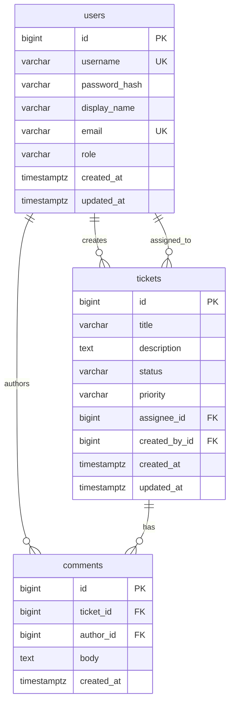

# Data Model: Support Ticket Management

**Database**: PostgreSQL (production), H2 (local/test)  
**ORM**: Spring Data JPA  
**Migrations**: Flyway (`V1__init_schema.sql`)

## Entity Relationship Diagram

## Tables

### `users`

| Column | Type | Constraints | Notes |
|--------|------|-------------|-------|
| `id` | `BIGSERIAL` | PK | |
| `username` | `VARCHAR(50)` | NOT NULL, UNIQUE | Login identifier |
| `password_hash` | `VARCHAR(255)` | NOT NULL | BCrypt |
| `display_name` | `VARCHAR(100)` | NOT NULL | Shown in UI / assignee filter |
| `email` | `VARCHAR(255)` | NOT NULL, UNIQUE | |
| `role` | `VARCHAR(20)` | NOT NULL | `ADMIN`, `DEVELOPER`, `QA`, `USER` |
| `created_at` | `TIMESTAMPTZ` | NOT NULL | Default `now()` |
| `updated_at` | `TIMESTAMPTZ` | NOT NULL | Updated on change |

**Indexes**: `idx_users_username` (unique), `idx_users_display_name` (for assignee filter search)

### `tickets`

| Column | Type | Constraints | Notes |
|--------|------|-------------|-------|
| `id` | `BIGSERIAL` | PK | |
| `title` | `VARCHAR(200)` | NOT NULL | Trimmed non-empty |
| `description` | `TEXT` | NOT NULL | Trimmed non-empty |
| `status` | `VARCHAR(20)` | NOT NULL | Enum below; default `OPEN` |
| `priority` | `VARCHAR(20)` | NOT NULL | Default `MEDIUM` |
| `assignee_id` | `BIGINT` | FK → `users.id`, NULL | Optional assignee |
| `created_by_id` | `BIGINT` | NOT NULL, FK → `users.id` | Ticket creator |
| `created_at` | `TIMESTAMPTZ` | NOT NULL | |
| `updated_at` | `TIMESTAMPTZ` | NOT NULL | |

**Indexes**:
- `idx_tickets_status` — status filter + grouped queries
- `idx_tickets_assignee_id` — default "my assignments" view
- `idx_tickets_created_by_id` — close-authorization checks
- `idx_tickets_title_lower` — optional functional index for search (`LOWER(title)`)
- Composite: `idx_tickets_assignee_status` — `(assignee_id, status)` for grouped assigned view

**Check constraints**:
- `status IN ('OPEN','IN_PROGRESS','RESOLVED','CLOSED','CANCELLED')`
- `priority IN ('LOW','MEDIUM','HIGH','CRITICAL')`

### `comments`

| Column | Type | Constraints | Notes |
|--------|------|-------------|-------|
| `id` | `BIGSERIAL` | PK | |
| `ticket_id` | `BIGINT` | NOT NULL, FK → `tickets.id` ON DELETE CASCADE | |
| `author_id` | `BIGINT` | NOT NULL, FK → `users.id` | |
| `body` | `TEXT` | NOT NULL | Trimmed non-empty |
| `created_at` | `TIMESTAMPTZ` | NOT NULL | Immutable after create |

**Indexes**: `idx_comments_ticket_id_created_at` — `(ticket_id, created_at ASC)`

## Enums (Java + DB)

### `TicketStatus`

`OPEN`, `IN_PROGRESS`, `RESOLVED`, `CLOSED`, `CANCELLED`

### `TicketPriority`

`LOW`, `MEDIUM`, `HIGH`, `CRITICAL`

### `UserRole`

`ADMIN`, `DEVELOPER`, `QA`, `USER`

> Admin bootstrap user is **not** in `users` table when using properties-based admin login (FR-001). Admin-created DB users with `ADMIN` role manage users via admin UI.

## State Transitions (enforced in `TicketTransitionPolicy`, not DB triggers)

| From | To | Who |
|------|-----|-----|
| OPEN | IN_PROGRESS | Developer, QA |
| OPEN | CANCELLED | Developer, QA |
| IN_PROGRESS | RESOLVED | Developer, QA |
| IN_PROGRESS | CANCELLED | Developer, QA |
| RESOLVED | CLOSED | Ticket creator, QA |

Terminal: `CLOSED`, `CANCELLED` — no outbound transitions.

## Validation Rules (application layer)

| Entity | Field | Rule |
|--------|-------|------|
| Ticket | title | Not blank after trim; max 200 chars |
| Ticket | description | Not blank after trim |
| Ticket | assignee | Must exist if provided |
| Comment | body | Not blank after trim |
| User | username | Unique; 3–50 chars |
| User | email | Unique; valid email format |
| User | password (on create/reset) | Min 8 chars (configurable) |

## Audit Fields

Per spec: **no field-level audit history** in v1. Only `created_at` / `updated_at` on tickets and users; `created_at` on comments.

## Query Patterns

| Use Case | Query Pattern |
|----------|---------------|
| Grouped list (assigned) | `WHERE assignee_id = :me [AND filters]` per status, `LIMIT 30 OFFSET page*30` |
| Grouped list (all) | No assignee filter unless `assigneeId` param |
| Keyword search | `(LOWER(title) LIKE :q OR LOWER(description) LIKE :q)` |
| Assignee filter | `assignee_id = :id` OR join users on `display_name ILIKE` |
| Detail + comments | Ticket by id; comments `ORDER BY created_at ASC` |

## Volume Assumptions

≤1,000 tickets (SC-003). Indexes above sufficient without FTS.
